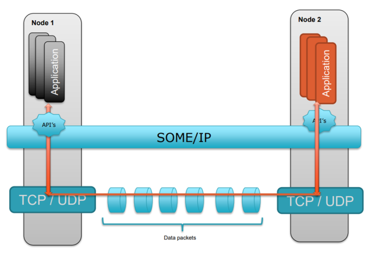

## Background

# What is SOME/IP in Automotive AUTOSAR?

SOME/IP is an automotive middleware solution that is used for control messages over [Ethernet](https://z-timeline.com/basics-of-ethernet-tutorial-a-definitive-guide/). SOME/IP is short for Scalable Service-Oriented Middleware over IP. It supports remote procedure calls, event notifications in the underlying serialization wire format. It is a service-oriented architecture meaning, a sender only sends data when atleast one receiver in the network needs the data. The advantage of this procedure is that the network and all connected nodes are not loaded with unnecessary data.

SOME/IP can be implemented on different operating systems i.e. AUTOSAR, Genivi Linux ,OSEK, and even embedded systems without an operating system. SOME/IP is used for inter-ECU Client/Server Serialization. An implementation of SOME/IP allows AUTOSAR to parse the RPC PDUs and transport the signals to the application. SOME/IP has also emerged as the middleware solution for Adaptive AUTOSAR.

The representation of the SOME/IP architecture in the OSI layer (protocol stack) is as below:

## Why SOME/IP is required in Automotive?

[Automotive technology](https://z-timeline.com/automotive-ethernet-what-is-driving-force-to-the-adaption-of-in-vehicle-networks-to-ethernet/) is growing rapidly with wider applications to it. All of these growing automotive applications are driving the automotive bandwidth requirements. We are talking about applications that provide navigation via GPS, real-time traffic updates, V2X connectivity, ADAS, precise telematics systems for in-vehicle navigation to think beyond CAN, Flexray, and MOST.

Ethernet emerged as the best fit considering the changing communication requirements of the ECU both within the vehicle. With this ethernet needed a middleware solution to transport control data in Automotive. The middleware control data communication should:

- Support CAN like communication.
- Support MOST like control communication.
- Shall efficiently support switched medium.

To address these needs **SOME/IP** was created.

## What are the features of SOME/IP?

#### SOME/IP Header:

- SOME/IP header is 16 bytes long:
  - 1st 4 bytes contains message identifier. 
  - 2nd 4 bytes contains message length.
  - 3rd 4 bytes contains request identifier.
  - 12th byte contains SOME/IP protocol version.
  - 13th byte contains service interface major version.
  - 14th byte contains message type, ex:
    - Notification
    - Request
    - Response
    - Request no return
  - 15th byte contains possible message error code.
- SOME/IP Payload: 
  - Contains content of a serialized method, event or field

SOME/IP serialized data header format is as below([from SOME/IP Protocol Specification 2016-11-30 Initial Release 1.0.0](https://www.autosar.org/fileadmin/user_upload/standards/foundation/1-0/AUTOSAR_RS_SOMEIPProtocol.pdf#page=15&zoom=100,352,392) ) :

the latest release https://www.autosar.org/fileadmin/user_upload/standards/foundation/21-11/AUTOSAR_RS_SOMEIPProtocol.pdf

## Reference

1. https://z-timeline.com/what-is-some-ip-in-autosar/
